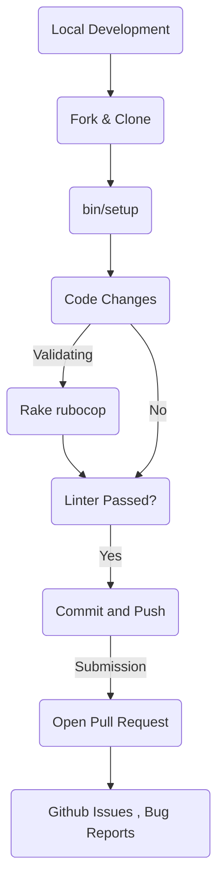

# Contribution Workflow

This page provides a practical guide for developers who wish to contribute to the `jekyll-shiki` project. It covers the technical lifecycle of a contribution, from initial environment setup to the automated checks required before a Pull Request (PR) is accepted.

## 1. Local Environment Setup

The project provides automated scripts to ensure a consistent development environment. Before contributing, developers should fork the repository and initialize their local copy.

### Initializing the Workspace

The primary entry point for environment configuration is bin/setup. This script automates the cleanup of stale artifacts and the installation of dependencies.

- **Cleanup**: It removes `Gemfile.lock`, `.bundle/`, `vendor/`, `_site/`, and `.jekyll-cache/` to ensure no conflicting state exists.
- **Bundler Configuration**: It sets the local path to `vendor/bundle` and disables system gems to maintain an isolated environment.
- **Dependency Resolution**: It executes bundle install to fetch the required Ruby gems.

The `Rakefile` also provides a convenience task to trigger this process:

```sh
rake setup
```

## 2. Development Lifecycle & Data Flow

The following diagram illustrates the workflow from local environment initialization to the submission of a contribution.

### Workflow: Contribution Pipeline



## 3. Code Quality and Standards

The project enforces strict coding standards via **RuboCop**. All contributions must pass the default linting rules before they are considered for merging.

### Automated Linting

The Rakefile defines rubocop as the default task. This means running `bundle exec rake` without arguments will trigger a full scan of the codebase.

#### Pre-Submission Checklist

1. **Bug Reports**: If you are fixing a bug, ensure there is a corresponding issue on GitHub at <https://github.com/phothinmg/jekyll-shiki/issues>
2. **Pull Requests**: Ensure your PR target is the `main` branch
3. **Linting**: Run the following command to ensure compliance with the project's style guide:

   ```sh
   bundle exec rake rubocop
   ```

4. **Code of Conduct**: All contributors are expected to adhere to the Contributor Covenant
